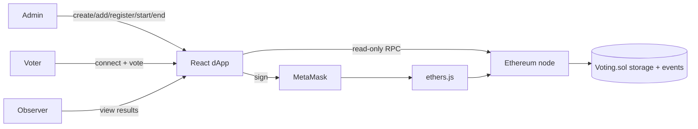
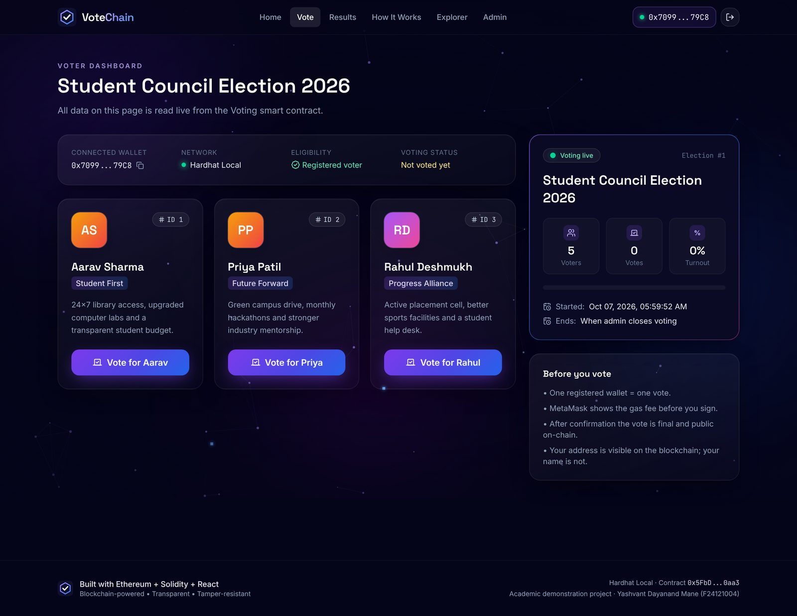
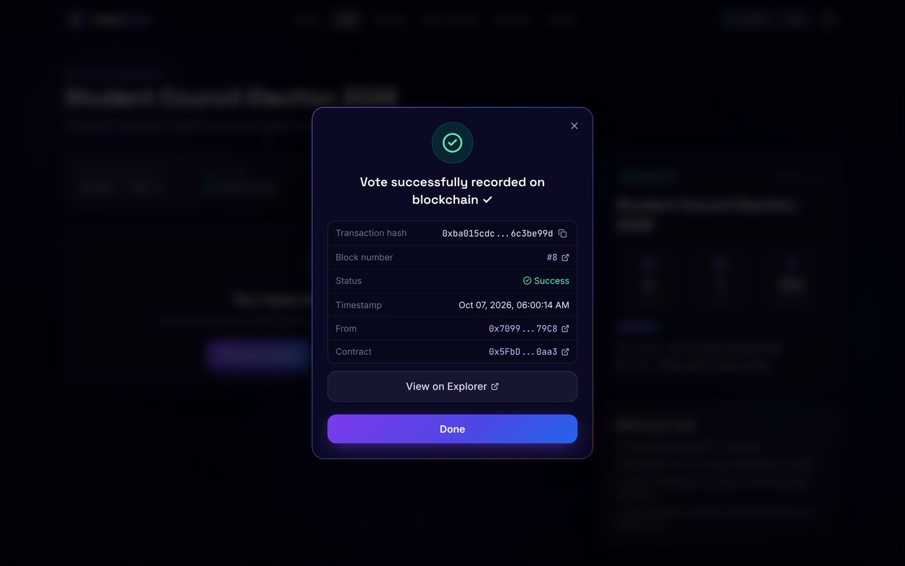
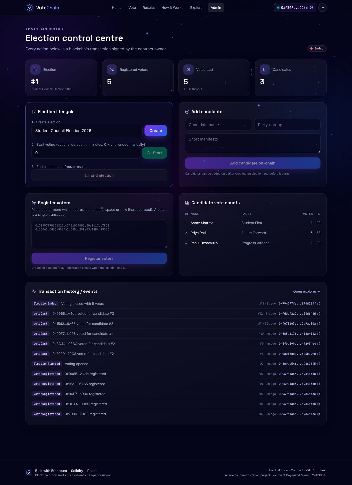

# VoteChain – Decentralized E-Voting System

> **Mini project · B.E. Computer Engineering · MES Wadia College of Engineering, Pune (SPPU) · 2026–27**
> **Yashvant Dayanand Mane** · PRN F24121004 · Roll No. 68 · Guide: Dr. S. R. Khonde
> 📄 Full report: [`docs/VoteChain_Mini_Project_Report.pdf`](docs/VoteChain_Mini_Project_Report.pdf)

VoteChain is a blockchain-based e-voting dApp. A Solidity smart contract (`Voting.sol`) is the **single source of truth** for registered voters, candidates, voting status, who has voted, vote counts and election status. The React frontend only displays what the contract says. There is no central database.

> ⚠️ **Academic demonstration only.** Not suitable for real government elections, which need verified identity, ballot secrecy, coercion resistance and legal infrastructure. Wallet addresses and transactions are public, so votes are **pseudonymous, not anonymous** (see [Security](#16-security-considerations)).

---

## 1. Project overview
Admin creates an election, adds candidates, registers eligible wallet addresses, then starts and ends voting. Voters connect MetaMask, check eligibility, view candidates and cast **exactly one** vote. Anyone can view the live, verifiable results and every transaction in the built-in explorer.

## 2. Problem statement
Centralized e-voting stores votes in a database controlled by the operator, so voters must trust that nobody altered it. VoteChain moves the voting rules and the ballot box into a public smart contract.

## 3. Objectives
- On-chain election, candidate, voter and vote management with OpenZeppelin `Ownable` access control
- One vote per registered wallet; reject invalid candidates and votes outside the voting window
- Events for every action: `VoterRegistered`, `CandidateAdded`, `ElectionStarted`, `VoteCast`, `ElectionEnded`
- A polished React dApp: voter dashboard, live results, admin dashboard, explorer
- Full test coverage of the contract (24 tests)

## 4. Why blockchain?
Immutability, a shared source of truth, rules enforced by code, cryptographic signatures and a public audit trail. Even the admin cannot change a vote once it is cast.

## 5. System architecture
```
Frontend (React + Vite + TS)
   ↓
MetaMask (signs transactions)
   ↓
ethers.js v6 (ABI encode/decode)
   ↓
Ethereum-compatible blockchain (Hardhat 31337 / Sepolia)
   ↓
Voting smart contract (Voting.sol)
   ↓
Blockchain state + event log
```
Reads use a read-only JSON-RPC provider, so results are visible without a wallet. Writes are always signed in MetaMask.



**DFD Level 1 (summary):** 1.0 Wallet connect → 2.0 Manage election (D1 Elections, D2 Candidates) → 3.0 Register voters (D3 Voters) → 4.0 Cast vote (reads D1/D3, updates D2, writes D4 Event log) → 5.0 Compute results → 6.0 Explorer/audit. All data stores are on-chain. The use case diagram, sequence diagram, flowchart and state diagram are in the PDF report.

## 6. Technology stack
| Layer | Tech |
|---|---|
| Contract | Solidity 0.8.24, OpenZeppelin 5 (Ownable) |
| Dev / test | Hardhat 2, Mocha/Chai, TypeScript |
| Frontend | React 18, Vite 6, TypeScript, React Router |
| UI | Tailwind CSS 4, Lucide React, Recharts, react-hot-toast |
| Web3 | MetaMask, ethers.js v6 |

## 7. Smart contract explanation
`blockchain/contracts/Voting.sol`

| Struct | Fields |
|---|---|
| `Candidate` | `id, name, party, manifesto, voteCount` |
| `Voter` | `registered, hasVoted` |
| `Election` | `title, startTime, endTime, started, ended` |

| Function | Access |
|---|---|
| `createElection(title)` | owner |
| `addCandidate(name, party, manifesto)` | owner, before start |
| `registerVoter(addr)` / `registerVoters(addr[])` | owner |
| `startElection(durationSeconds)` (0 = until ended) | owner, before start |
| `endElection()` | owner |
| `vote(candidateId)` | registered voter, while open, once |
| `getElectionInfo`, `getCandidates`, `getCandidate`, `getVoterStatus`, `getWinners`, `isVotingOpen`, `getCandidatesOf` | public view |

Custom errors (`NotRegistered`, `AlreadyVoted`, `InvalidCandidate`, `ElectionNotStarted`, `ElectionNotActive`, …) save gas and are decoded into friendly messages by the frontend. Mappings are keyed by election id, so new elections start clean while old results stay verifiable.

## 8. Frontend architecture
```
frontend/src/
├── contracts/   config.ts (address, ABI, chainId, explorer from .env) + VotingABI.json
├── services/    votingService.ts – the only module that talks to the chain
├── hooks/       useWallet, useElection (polls every 5 s), useTransactions, useChainEvents
├── components/  Navbar, Footer, NetworkBackground, CandidateCard, ConfirmVoteModal, TxModal, TxDetails, ui
├── pages/       Home, ConnectWallet, Vote, Results, HowItWorks, Admin, Explorer, NotFound
├── utils/       errors.ts, explorer.ts, format.ts, events.ts
└── types/
```

## 9. Installation
Requirements: Node.js 18+, npm, Chrome/Brave/Firefox with MetaMask.
```bash
git clone <this repo>
cd votechain/blockchain && npm install
cd ../frontend && npm install
```

## 10. MetaMask setup
Add a network: **RPC** `http://127.0.0.1:8545`, **Chain ID** `31337`, **Symbol** ETH. Import accounts with the private keys printed by `npx hardhat node`.

## 11. Local blockchain setup
```bash
cd blockchain
npx hardhat test      # 24 passing
npx hardhat node      # keep this terminal open
```
> No internet access to `binaries.soliditylang.org`? Prefix commands with `SOLC_OFFLINE=true` to compile with the bundled solcjs.

## 12. Contract deployment
```bash
npm run deploy:local   # deploys Voting.sol, writes frontend/.env.local and src/contracts/VotingABI.json
npm run seed:local     # demo election + 3 candidates + registers Hardhat accounts #1–#5
# Sepolia: fill blockchain/.env (SEPOLIA_RPC_URL, PRIVATE_KEY) then
npm run deploy:sepolia
```

## 13. Frontend configuration
`frontend/.env.local` (auto-generated; see `.env.example`):
```
VITE_CONTRACT_ADDRESS=0x5FbDB2315678afecb367f032d93F642f64180aa3
VITE_CHAIN_ID=31337
VITE_CHAIN_NAME=Hardhat Local
VITE_RPC_URL=http://127.0.0.1:8545
VITE_EXPLORER_URL=            # e.g. https://sepolia.etherscan.io
VITE_DEPLOY_BLOCK=1
```

## 14. How to run
```bash
cd frontend && npm run dev     # http://localhost:5173
npm run build                  # production build in dist/ (vercel.json / _redirects included)
```

## 15. How voting works
1. Admin (account #0) opens **Admin**, then clicks **Start**.
2. Voter connects MetaMask, and the **Vote** page shows eligibility and candidates.
3. Voter clicks **Vote**, confirms in the modal, then approves in MetaMask.
4. Pending loader, then block confirmation, then the hash, block, timestamp and “View on Explorer”.
5. The contract checks status, registration, double vote and candidate id, increments the count and emits `VoteCast`.
6. **Results** update live; after **End election** the winner is shown.

## 16. Security considerations
- `onlyOwner` on every admin function; UI guard plus on-chain enforcement
- Phase modifiers (`beforeStart`, `onlyWhileOpen`) and an optional deadline
- Checks-effects pattern, no ETH and no external calls in `vote()`
- Custom errors, `calldata`, batch registration, optimizer on
- **Transparency ≠ privacy:** anyone can audit counts and double-vote prevention, but `vote()` calldata and `VoteCast` link a wallet to a choice. Votes are pseudonymous, not anonymous.

## 17. Limitations
No ballot secrecy or coercion resistance; one wallet ≠ one verified person; single admin key; gas cost per vote; polling instead of an indexer.

## 18. Future enhancements
ZK privacy (Semaphore/MACI), identity integration, multisig/DAO admin, gasless meta-transactions, IPFS for media, Layer-2 deployment, ranked-choice voting.

## 19. Screenshots
| | |
|---|---|
|  |  |
|  |  |
|  |  |
|  |  |

## 20. Demo credentials / wallet instructions
These are the standard Hardhat **test** accounts (public keys; never use them on mainnet):

| Role | Address |
|---|---|
| Admin (owner) – #0 | `0xf39Fd6e51aad88F6F4ce6aB8827279cffFb92266` |
| Voter #1 | `0x70997970C51812dc3A010C7d01b50e0d17dc79C8` |
| Voter #2 | `0x3C44CdDdB6a900fa2b585dd299e03d12FA4293BC` |
| Voter #3 | `0x90F79bf6EB2c4f870365E785982E1f101E93b906` |
| Voter #4 | `0x15d34AAf54267DB7D7c367839AAf71A00a2C6A65` |
| Voter #5 | `0x9965507D1a55bcC2695C58ba16FB37d819B0A4dc` |
| Unregistered (demo rejection) – #6 | `0x976EA74026E726554dB657fA54763abd0C3a0aa9` |

Private keys are printed by `npx hardhat node`. After restarting the node, run deploy and seed again, and in MetaMask use *Settings → Advanced → Clear activity tab data* to reset nonces.

## Presentation points
Problem, then smart contract as ballot box, architecture, on-chain rules, live demo (vote, duplicate rejected, results, end, winner), explorer, 24 tests, transparency vs privacy, future work.
